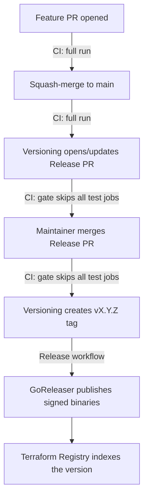

# CI and release pipeline

Human-oriented map of how a change travels from a pull request to a published
release, and why the pipeline skips work it doesn't need. For the
release/registry runbook see [RELEASE.md](RELEASE.md); this document covers
the CI mechanics.

## Workflows at a glance

| Workflow | File | Trigger | Purpose |
|---|---|---|---|
| CI | `.github/workflows/test.yml` | PR, push to `main` | Lint, unit, acceptance, integration and docs checks |
| CodeQL (advanced) | `.github/workflows/codeql.yml` | PR, push to `main`, weekly cron | Static security analysis, owns the "CodeQL (go)" check |
| PR Title Check | `.github/workflows/pr-title.yml` | PR | Enforces Conventional Commit PR titles (they become the squash-commit messages release-please reads) |
| Versioning | `.github/workflows/versioning.yml` | After every CI run on `main` (`workflow_run`) | release-please: opens/updates the Release PR; creates the tag when it merges |
| Release | `.github/workflows/release.yml` | Push of a `v*` tag | GoReleaser: builds, signs and publishes binaries |
| Stale | `.github/workflows/stale.yml` | Daily cron | Labels inactive issues/PRs |

## Life of a change

A single code change used to run the full acceptance suite **four** times on
its way to a release (PR, merge, Release PR, Release PR merge). The `changes`
gate in `test.yml` cuts that to the two runs that test something new — the
Release PR only touches `CHANGELOG.md` and `.release-please-manifest.json`,
so re-testing the already-merged code there added minutes and runner cost but
no signal.

## The changes gate

The first job in CI, `changes`, uses
[dorny/paths-filter](https://github.com/dorny/paths-filter) to classify the
diff, and every other job declares `needs: changes` plus an `if:` condition
on its outputs:

| Output | True when the diff contains | Jobs it enables |
|---|---|---|
| `code` | Anything except `**/*.md`, `docs/**`, `LICENSE`, `.release-please-manifest.json` | Lint, Unit, Acceptance, Integration, Docs |
| `docs` | `docs/**` | Docs (sync check runs even for hand-edits to generated docs) |

What runs for typical changes:

| Change | Lint / Unit / Acceptance / Integration | Docs | CI OK |
|---|---|---|---|
| Go code, workflows, integration fixtures | ✅ | ✅ | ✅ |
| README / CHANGELOG / LICENSE only | skipped | skipped | ✅ |
| `docs/**` only | skipped | ✅ | ✅ |
| Release PR (changelog + manifest) | skipped | skipped | ✅ |

### Why a gate job instead of workflow-level `paths-ignore`

`paths-ignore` on the workflow trigger looks simpler but breaks two things:

1. **Required checks are never reported on filtered PRs.** Branch protection
   requires the CI job checks; if the workflow doesn't trigger at all, the
   checks stay "Expected" forever and a docs-only PR can never be merged.
   A job skipped by an `if:` condition, by contrast, reports "skipped" —
   which **does** satisfy branch protection.
2. **The release chain dies.** `versioning.yml` triggers on
   `workflow_run: [CI]`. If a push to `main` doesn't start CI at all, that
   event never fires — release-please wouldn't run after the Release PR
   merge and the tag would never be created. With the gate, CI always runs
   (its jobs just skip), so `workflow_run` always fires.

### The CI OK job

`ci-ok` runs `if: always()`, checks every other job's result, and fails if
any of them failed or was cancelled ("skipped" is fine). It exists because:

- a run whose jobs were **all** skipped needs at least one executed job for
  the run-level conclusion — which gates Versioning — to be a deterministic
  `success`;
- branch protection can require just "CI OK" instead of enumerating every
  job name (today it still lists the individual jobs; both work, since
  skipped checks satisfy protection).

## Cost and speed effect

Measured on a typical release cycle (Aug 2026): a full CI run takes ~4–4.5
minutes, dominated by the acceptance job (Dockerized Jenkins). The gate
removes two full runs per release — the Release PR and its merge commit both
finish in seconds — cutting post-merge release latency roughly in half
(the remaining time is GoReleaser's ~6-minute build) and dropping the
repository's Actions consumption accordingly.

## Editing the pipeline — invariants to keep

- **Don't add `paths`/`paths-ignore` to `test.yml` or `codeql.yml` triggers**
  (see above; `codeql.yml` has the same required-check constraint).
- **Keep `ci-ok` in `needs` sync**: a new job in `test.yml` must be added to
  the `ci-ok` `needs:` list, or its failure won't block merges once branch
  protection points at "CI OK".
- **New "expensive" jobs should take the gate**: `needs: changes` +
  `if: needs.changes.outputs.code == 'true'`.
- **The gate's ignore list must stay a subset of "files that can't affect
  the binary or tests"** — when in doubt, let the job run.
